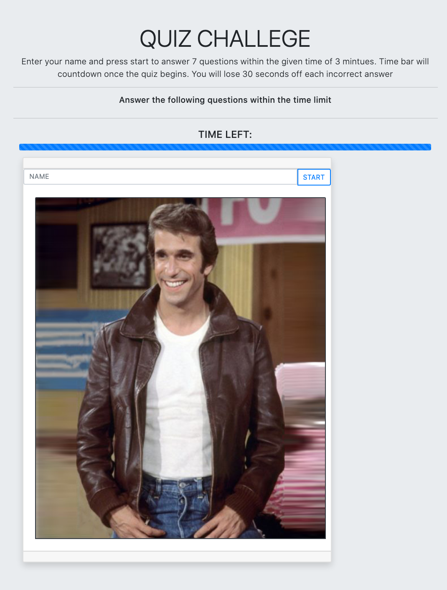
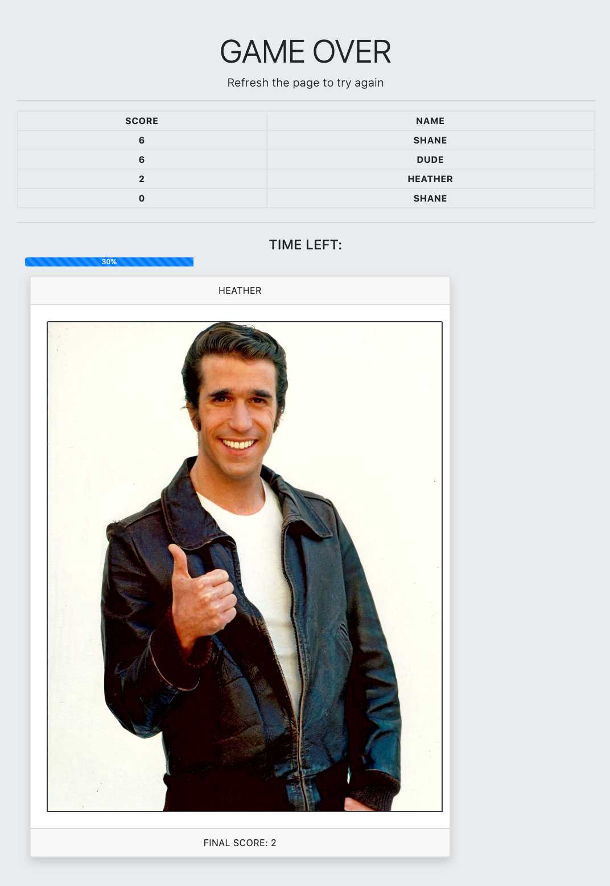

# hw4-quiz

SITE can be accessed here: [QUIZ](https://trilambda122.github.io/hw4-quiz/). Created with straight javascript

Create a multible choice quiz application, that has countdown timer, and score keeping 
Time will be deducted for incorrect answers, added for correct answers. Score will be incremented by 1 for each correct answer. Top 10 high scores to be displayed at the end.  

>shane@sschilling.com
---
CURRENT KNOW BUGS:

TODO:
- [X] UI
  - [X] Create Shell HTML
    - [X] Container for questions
    - [X] Container for Answer buttons
    - [X] Container for timer and score area output
      - [X] Timer will need 2 output areas, Minutes and seconds (used progress bar instead)
      - [X] format coundown instead progress bar correctly
    - [X] Container for stauts (correct or incorrect)
  - [X] Create Start Button
  - [X] Create answer buttons from array or object of question answer pairs
  - [X] create player card 
    - [X] create name field
    - Display highscores at the end of the quiz
  [X] Logic
  - [X] Quesitons
    - [X] Create Question/answer array or Object to hold question, possible answers and correct answer flag
  - [X] Create Timer countdown logic
    - [X] create function to calc timer seconds into mintues and seconds and display on the page
    - [X] create function to add or subtract time based on correct or incorect answer
    - [X] create function to track and display the score 
    - [X] create function to add to the score on correct answers.
    - [X] create logix that ends the quiz when the timer hits zero
  - [X] Answers
    - [X] create function to get and display answers as buttons from the object or array called quesitons
    - [X] add listeners to answer buttons for the click events
    - [X] create logix that measures if the answers are correct or incorrect  
  - [ ] Quiz End
    - [X] Display highscores at end of game 
  
